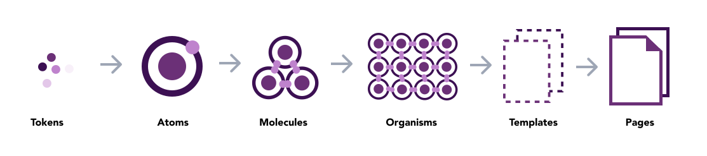
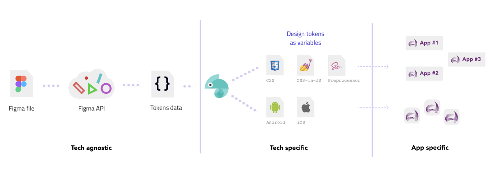
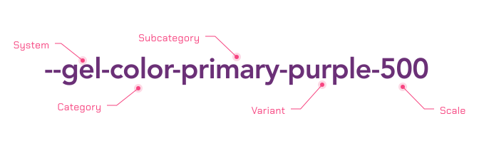
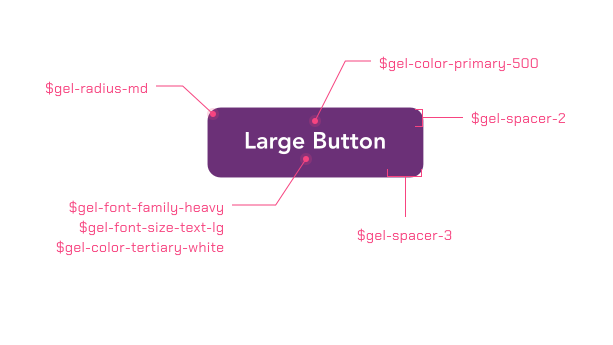

> It's a technology-agnostic architecture and process for scaling design across multiple platforms and devices, including native, and more

Design tokens are visual values that construct and maintain a design system, and they include spacing, color, typography, shadows, object styles, animation and others. They maintain a consistent and scalable visual system for development, and also function as a replacement for hard-coded values, such as hex and Pantone values of a specific color. 

Setting up tokens helps designers and developers collaborate in an easier and faster way and, besides keeping the design implementation consistent in development, they also help in the automation process. As design tokens are often considered design atoms of a design system.

At AEMO, We follow [Atomic Design](https://atomicdesign.bradfrost.com/) methodology. In the world of UI, design tokens are subatomic particles. The design token `gel-color-primary-purple-500` is a critical ingredient of a UI, but it’s not exactly functional on its own. It needs to be applied to an “atom” (such as the background color of a button) in order to come to life.
 

## Token Lifecycle
The design team has created a design file using Figma that contains the design specifications for UI components. [Figma Tokens](https://docs.tokens.studio/) is a Figma Plugin allowing us to integrate Tokens into Figma designs. We use it generate design tokens represented by JSON following the Category/Item/Type structure.

Then, we’ll need to get those generated design tokens into [Style dictionary](https://amzn.github.io/style-dictionary/#/).

Finally, we need to execute the transformation of our tokens in the style dictionary to export the design tokens as platform deliverables that can be consumed by all of our applications at AEMO.

Here’s a visual representation of our goal:
 

## Token Format
Effective token names improve and sustain a team’s shared understanding of visual style through design, code, and other interdisciplinary handoffs. 

 

## Token Demo
Whenever a component is created, we discuss — with the designers and developers involved in the design system — the possible states and variants of the component, and its specific design decisions. Then we translate all these specifications into specific design tokens.

 

