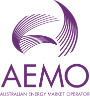

> The logo is an essential element of the AEMO brand.
For maximum flexibility, there is a horizontal format and a stacked format of the logo available for use.

## Primary

For maximum flexibility, there is a horizontal format and a stacked format of the logo available for use.

##### Horizontal

 

##### Stacked

## Secondary

The secondary logo is a simplified version of the primary logo that has the sub-line of text removed. It is designed to scale and function at small sizes for print and digital applications. It can be used where legibility and readability of the primary logo text at small sizes is an issue, such as on screenprinting and embroidery applications.

## Colour variations

The colour logo is the preferred version of the logo for use. When using the colour logo it should always be placed on a white background.
The black logo is available when black and white or grayscale designs are needed. The black logo should also only be placed on a white background.
The reverse logo should only be used on solid background colours. Avoid using the reverse logo on patterns or photographs, as this could obstruct visibility.

## Favicons

:::warning

Consistency is important – please don’t edit, change, distort, recolour or reconfigure it. Always use the logo files provided.

:::